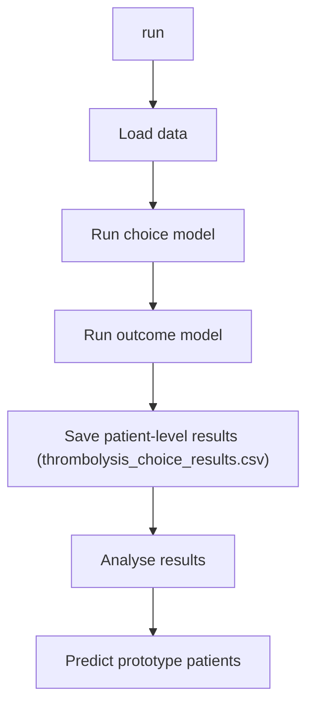

# Notes on Production Demo

## Data

### `ml_data.csv`

Data for machine learning. Patient-level data for all patients arriving within 4 hours of known stroke onset (and with known scan time). All teams included have at least 250 admissions and 10 thrombolysis in the data set.

| Field                     | Description                                                               |
|---------------------------|---------------------------------------------------------------------------|
| stroke_team               | Admitting stroke team ID                                                  |
| age                       | Age (research used 5 year age bands)                                      |
| onset_to_arrival_time     | Time (minutes) from stroke onset to arrival at admitting unit (if known)  |
| onset_during_sleep        | Onset during sleep (0=No, 1=Yes)                                          |
| precise_onset_known       | Onset time known precisely (0=Best Estimate, 1=Precise)                   |
| male                      | Male  (0=No, 1=Yes)                                                       |
| arrival_to_scan_time      | Time (minutes) from arrival to scan                                       |
| infarction                | Stroke type is infarction ( (0=Haemorrhage, 1=Infarction)                 |
| stroke_severity           | Total NIHSS                                                               |
| prior_disability          | Disability (mRS) before stroke                                            |
| afib_anticoagulant        | Patient taking anticoagulants for atrial fibrillation (0=No, 1=Yes)       |
| any_afib_diagnosis        | Patient has diagnosis of atrial fibrillation (prior, or during admission) |
| scan_to_thrombolysis_time | Time (minutes) from scan to thrombolysis given (where appropriate)        |
| onset_to_thrombolysis     | Time (minutes) from onset to thrombolysis given (where appropriate*)      |
| thrombolysis              | Thrombolysis given  (0=No, 1=Yes)                                         |
| discharge_disability      | Disability (mRS) at discharge from inpatient care                         |
| thrombectomy              | Thrombectomy performed  (0=No, 1=Yes)                                     |

*onset_to_thrombolysis is set to a dummy value of 99999 when not received.

### `prototype_patients.csv`

Prototype patients are a set of 17 patients to help explore variation in thrombolysis use at each team.

The *ideal* patient (an obvious candidate for thrombolysis) has the following characteristics:

| Patient prototype     | Ideal |
|-----------------------|-------|
| stroke_team           | NA    |
| onset_to_arrival_time | 90    |
| onset_during_sleep    | 0     |
| arrival_to_scan_time  | 15    |
| infarction            | 1     |
| stroke_severity       | 15    |
| precise_onset_known   | 1     |
| prior_disability      | 0     |
| afib_anticoagulant    | 0     |
| age                   | 72.5  |

These are then changed in the following way (with combinations of these changes in the csv file):

* *Mild*: stroke_severity = 3
* *Late*: onset_to_arrival_time = 225
* *Prior disability*: prior_disability = 3
* *Imprecise*: precise_onset_known = 0
* *Age*: age= 87.5

### `patient_pathway_data.csv`

Data for pathway simulation model. Patient-level data for all emergency stroke patients.

| Field                     | Description                                                              |
|---------------------------|--------------------------------------------------------------------------|
| stroke_team               | Admitting stroke team                                                    |
| arrive_by_ambulance       | Did patient arrive by ambulance (0=No, 1=Yes)                            |
| age                       | Age (research used 5 year age bands)                                     |
| onset_to_arrival_time     | Time (minutes) from stroke onset to arrival at admitting unit (if known) |
| onset_known               | Was onset time known (0=No, 1=Yes)                                       |
| arrival_to_scan_time      | Time (minutes) from arrival to scan                                      |
| infarction                | Stroke type is infarction ( (0=Haemorrhage, 1=Infarction)                |
| thrombolysis              | Thrombolysis given  (0=No, 1=Yes)                                        |
| scan_to_thrombolysis_time | Time (minutes) from scan to thrombolysis given (where appropriate)       |

## Outputs

### `thrombolysis_choice_results.csv`

Full patient results, includes patient feature values, observed, predicted and benchmark thrombolysis decisions, predicted outcomes with and without thrombolysis (mRS probabilities, probability-weighted mRS, proportion mRS 0-4, utility, improved outcome*, comparisons of predicted improved outcome with observed thrombolysis use).

* Improved outcome is when thrombolysis is predicted to improve probability-weighted mRS *and* improve proportion mRS 0-4.

### `thrombolysis_outcome_predictions_by_team.csv`

Averages of `thrombolysis_choice_results` by team, and also adds:

* *Sensitivity* = proportion of patients who are predicted to benefit from thrombolysis who received thrombolysis

* *Specificity* = proportion of patients who are predicted to NOT benefit from thrombolysis who did NOT received thrombolysis

### `thrombolysis_choice_hospital_shap.csv`

Mean hospital SHAP for each hospital.
Higher hospital SHAP indicates higher willingness to use thrombolysis
Benchmark hospitals are identified (highest hospital SHAP)

### `thrombolysis_choice_shap.csv`

Patient SHAP values for each feature in the thrombolysis choice predictions

### `prototype_patients_all_teams.csv`

Records percentage of prototype patients likely to receive thrombolysis at each stroke team.

Also records the percentage of prototype patients likely to receive thrombolysis across the benchmark stroke teams.

### `data_for_sim.csv`

Calculated data for the pathway simulation model.

## Classes

### ThrombolysisChoiceOutcome

#### `__init__` (constructor)

* Defines X and y fields for thrombolysis choice and stroke outcome models.
* Sets the number of hospitals to use as benchmark hospitals.
* Stores Utilities values for each disability (mRS) level.

#### `run`

The main run method:

* Loads data 
Re-runs thrombolysis choice and outcome models if required, and saves patient-level results
* Analyses patient-level results by stroke team
* Predicts thrombolysis use of prototype patients at each stroke team

#### `load_data`

* Loads `ml_data.csv` for machine learning (see **Data** section above for further details on this data.)
* Creates a synthetic `simulated_onset_to_thrombolysis` time for all patients by adding 20 minutes to the onset-to-scan time. This is used to estimated benefit of thrombolysis in all patients, including patients who did not actually receive thrombolysis.
* Get a list of stroke teams present in `ml_data.csv`.
* Load `prototype_patients.csv` to predict use of thrombolysis in this patient set in all stroke teams.

#### `run_choice_model`

Train a model to predict thrombolysis choice.

* Get X and y data
* One-hot encode stroke teams
* Fit XGBoost model on all data (`learning_rate=0.5` prevents loss of effect of spare stroke team features)
* Get predictions of y, and assess accuracy
* Get hospital SHAP for each patients, and average by stroke team
* Identify benchmark hospitals (by hospital SHAP)
* Save hopsital SHAP values to `thrombolysis_choice_hospital_shap.csv`
* Get benchmark decisions for each patient
* Save all patients SHAP values to `thrombolysis_choice_shap.csv`

#### `run_outcome_model`

Train a model to predict outcomes (probabilities of discharge mRS). 
The model is trained only on infractions stroke patients who did not also have thrombectomy. 
Predictions of outcomes are made for all patients, but are removed for non-infarction stroke patients.

* Get X and y data
* One-hot encode stroke teams
* Fit XGBoost model on all data (`learning_rate=0.5` prevents loss of effect of spare stroke team features)
* Get predictions of outcomes (mRS probabilities), and assess accuracy
* Predict outcomes all patients with and without thrombolysis
    * Use onset to thrombolysis of 99999 when no thrombolysis
    * Use simulated_onset_to_thrombolysis for use of thrombolysis
* Calculate further outcome results from mRS probabilities:
    * Probability weighted mRS (untreated, treated, difference) 
    * Proportion mRS 0-4  (untreated, treated, difference) 
    * Utility  (untreated, treated, difference) 
    * Improved outcome (improved probability weighted mRS **and** improved proportion mRS 0-4)
* Compare outcomes with observed use of thrombolysis:
    * TP (true positive) = thrombolysis given and predicted improved outcome
    * FP (false positive) = thrombolysis given and predicted not improved outcome
    * FN (false negative) = thrombolysis not given and predicted improved outcome
    * TN (true negative) = thrombolysis not given and predicted not improved outcome
* Delete outcomes for non-infraction stroke

#### `analyse_results`

Analyse patient-level results.

* Load patient-level results
* Average patient-level results by stroke team
* For each team calculate:
    * *Sensitivity* = proportion of patients who are predicted to benefit from thrombolysis who received thrombolysis
    * *Specificity* = proportion of patients who are predicted to NOT benefit from thrombolysis who did NOT received thrombolysis
* Save collated results by team to `thrombolysis_outcome_predictions_by_team.csv`

#### `predict_prototype_patients_all_teams`

Predict thrombolysis choice for prototype patients for all stroke teams.

Uses thrombolysis choice model fitted in `run_choice_model`

* Get thrombolysis use benchmark prediction for each prototype patient 
    Record average proportion patients receiving thrombolysis across benchmark teams
* Get thrombolysis use prediction for each prototype patient at each stroke team
* Report thtombolysis use as a percentage (based on probability of receiving thrombolysis; this will also be the proportion of those patients who are likely to receive thrombolysis.
* Save as `prototype_patients_all_teams.csv`

#### `predict_prototype_patients_single_team`

* Get thrombolysis use benchmark prediction for each prototype patient 
    Record average proportion patients receiving thrombolysis across benchmark teams
* Get thrombolysis use prediction for each prototype patient at target team
* Create barchart of proportion of prototype patients likely to receive thrombolysis at benchmark teams and target team.

### CalculateSimParameters

Summarises patient pathways processes and speeds for the pathway simulation model.

For each stroke team records:

* *thrombolysis_rate*: The proportion of all arrivals receiving thrombolysis
* *admissions*: The number of admissions in the input data
* *age_80_plus*: The proportion of patients aged 80+ (of those arriving within 4 hrs of known stroke onset)
* *onset_known*: The proportion of patients with known onset time
* *known_arrival_within_4hrs*: The proportion of patients arriving within 4 hours of known onset time
* *onset_arrival_mins_mu*: Of those arriving in 4 hrs, the mean of log (ln) onset to arrival time
* *onset_arrival_mins_sigma*: As above, but standard deviation
* *scan_within_4_hrs*: Of those arriving in 4 hrs, the proportion of patients scanned within 4 hrs of arrival
* *arrival_scan_arrival_mins_mu*: Of those arriving in 4 hrs and scanned within 4 hrs arrival, the mean of log (ln) of arrival to scan time
* *arrival_scan_arrival_mins_sigma*: As above, but standard deviation
* *onset_scan_4_hrs*: The proportion with onset-to-scan within 4 hrs
* *eligible*: The proportion of patients with onset-to-scan within 4 hrs who receive thrombolysis
* *scan_needle_mins_mu*: For those receiving thrombolysis, the mean log (ln) scan-to-needle time
* *scan_needle_mins_sigma*: A above, but standard deviation

Saves resulting statistics to `data_for_sim.csv`

#### `__init__` (constructor)

* Creates the CalculateSimParameters object and loads patient level data.
* Required data is `patient_pathway_data.csv`
* Limits to ambulance arrivals if required (default is False)
* Removes stroke teams with fewer than 100 admissions in the input data

#### `calculate_parameters_for_pathway_simulation`

Loop through stroke teams (as groupby object):

* Record stroke team
* Record  admission numbers
* Get thrombolysis rate
* Record onset known proportion and remove rest (unknown onset time)
* Record onset-to-arrival <4hrs and remove rest (arrivals more than 4 hrs after stroke onset)
* Get proportion 80+
* Get log (ln) mean/sd of onset-to-arrival (remove any onset-to-arrival time of < 0)
* Remove any with arrival-to-scan time of <= 0
* Record proportion arrival-to-scan within 4 hours of arrival (and remove those with longer scan-to-arrival)
* Get log (ln) mean/sd of arrival-to-scan
* Get proportion of patients with onset-to-scan of <=4hrs, and remove patients with onset-to-scan of >4hrs
* Get proportion (of patients with onset-to-scan of <4hrs) receiving thrombolysis
* Get log (ln) mean/sd of scan-to-needle

Saves resulting statistics to `data_for_sim.csv`

### Pathway

Stroke pathway simulation

* To model any scenario, `model_ssnap_pathway_scenarios` is called
* `run` first runs a base-case scenario based on recorded hospital process statistics and then adjusts these statistics to investigate improvement scenarios.

The scenarios are:

* *BASE:* Current hospital performance
* *SPEED:* 30 mins arrival-to-thrombolysis (95% have scan within 4 hrs of arrival, arrival-to-scan and scan-to-needle each 15 minutes with no variation)
* *AMBO:* Subtract 15 minutes from onset-to-arrival times
* *KNOWN ONSET:* Set to the proportion of patients with known onset times to upper quartile of all teams if currently lower
* *BENCHMARK*: Apply expected thrombolysis use if *benchmark* thrombolysis used
* *KNOWN ONSET and SPEED*
* *SPEED and BENCHMARK*
* *KNOWN ONSET and BENCHMARK*
* *All changes except AMBO*
* *All changes including *AMBO*

####  `__init__` (constructor)

* Loads stroke team process statistics (`data_for_sim.csv`) generated by `CalculateSimParameters` object
* Loads actual and benchmark thrombolysis rates (`thrombolysis_rates.csv`)
* Limits data to stroke teams in both `data_for_sim` and `thrombolysis_rates`

#### `model_ssnap_pathway_scenarios`

Model of stroke pathway.

Each run mimics the passage of patients through the emergency stroke pathway.
Patient times through the pathway are sampled from distributions passed to the model using NumPy.
The model is run with replication (trials) and results reported across the trials.
Good outcomes are defined as mRS0-1.

The model used for outcome prediction is described at:

Estimation of stroke outcomes based on time to thrombolysis and thrombectomy
Michael Allen, Kerry Pearn, Ken Stein, Martin James
medRxiv 2020.07.18.20156653; doi: https://doi.org/10.1101/2020.07.18.20156653
https://www.medrxiv.org/content/10.1101/2020.07.18.20156653v1

Array (NumPy) columns generated as follows. Each column has an array of individual patients created by sampling from appropriate distributions:

    0: Patient aged 80+
    1: Allowable onset to needle time (may depend on age)
    2: Onset time known (boolean)
    3: Onset to arrival is less than 4 hours (boolean)
    4: Onset known and onset to arrival is less than 4 hours (boolean)
    5: Onset to arrival minutes
    6: Arrival to scan is less than 4 hours
    7: Arrival to scan minutes
    8: Minutes left to thrombolyse
    9: Onset time known and time left to thrombolyse
    10: Proportion ischaemic stroke (if they are filtered at this stage)
    11: Assign eligible for thrombolysis (for those scanned within 4 hrs of onset)
    12: Thrombolysis planned (scanned within time and eligible)
    13: Scan to needle time
    14: Clip onset to thrombolysis time to maximum allowed onset-to-thrombolysis
    15: Set baseline probability of good outcome based on age group
    16: Convert baseline probability good outcome to odds
    17: Calculate odds ratio of good outcome based on time to thrombolysis
    18: Patient odds of good outcome if given thrombolysis
    19: Patient probability of good outcome if given thrombolysis
    20: Clip patient probability of good outcome to minimum of zero
    21: Individual patient good outcome if given thrombolysis (boolean)*
    22: Individual patient good outcome if not given thrombolysis (boolean)*

*Net population outcome is calculated here by summing probabilities of good
outcome for all patients, rather than using individual outcomes. These columns
are added for potential future use.

Outputs are results across trials (median, low 5%, high 5%, mean, stdev, 95%ci):

* Baseline_good_outcomes_per_1000_patients
* Percent_Thrombolysis
* Additional_good_outcomes_per_1000_patients
* Mean_Onset_to_needle

